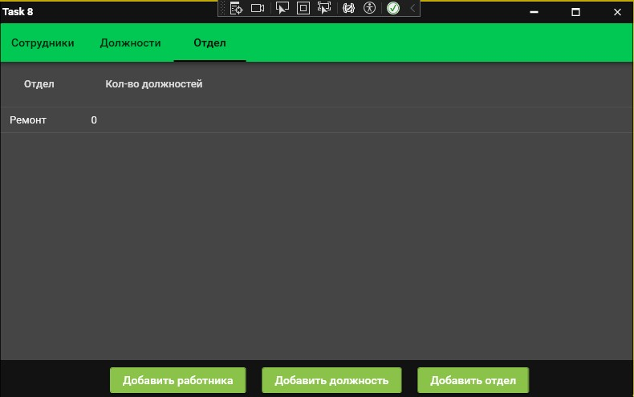
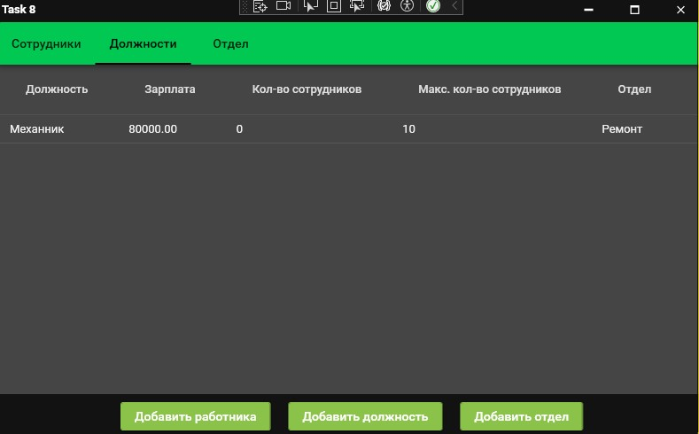

<h1>Задание 8. Управление базой данных сотрудников (MVVM)</h1>

<h3> Описание проекта</h3>

WPF-приложение для менеджмента с использованием:

<ul>
  <li><strong>Паттерна MVVM</strong> - архитектурный подход</li>
  <li><strong>SQLite</strong> - встроенная база данных</li>
</ul>

<h3> Основной функционал</h3>
<ul>
  <li>Управление отделами компании</li>
  <li>Редактирование должностей</li>
  <li>Работа с данными сотрудников</li>
  
</ul>

<h3> Инструкция по запуску</h3>
<ol>
  <li>Запустить исполняемый файл: <code>Task8SQLite.exe</code></li>
  <li>При первом запуске создается база данных</li>
</ol>

<h3> интерфейса</h3>

  
  
  

  Все данные хранятся в локальной SQLite базе

