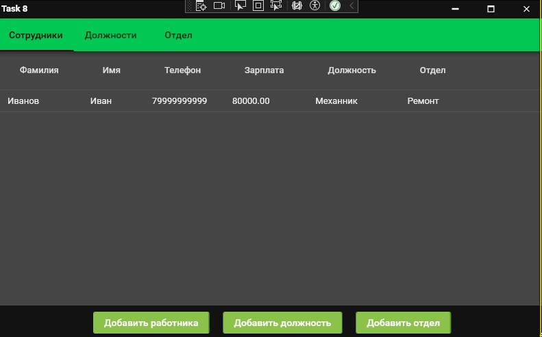

<h1>Задание 8.</h1>

Проект представляет собой WPF-приложение для управления базой данных сотрудников, реализованное с использованием паттерна MVVM

Приложение позволяет создавать и редактировать отдел, должность, работника.

Для заупуска необходимо запустить "Task8SQLite.exe"

